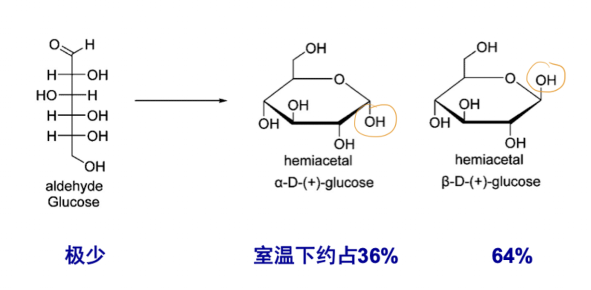
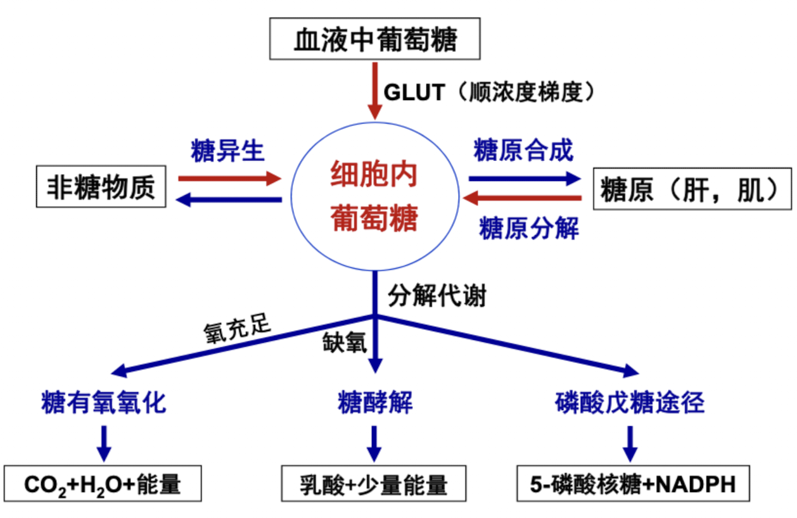
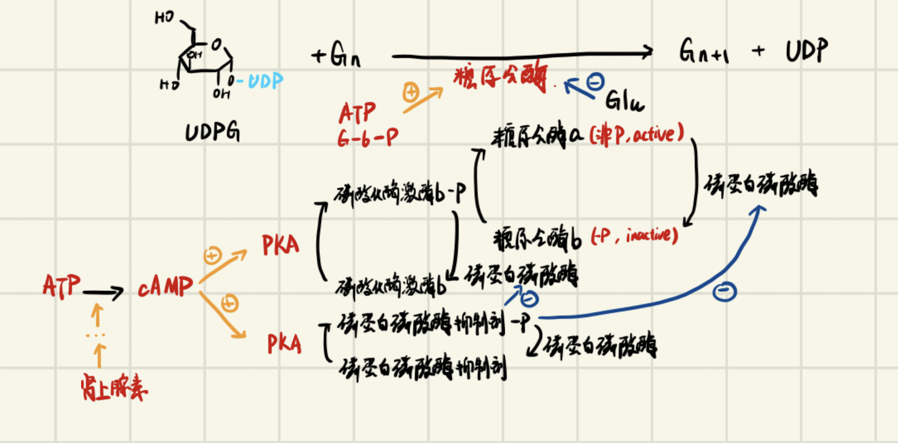
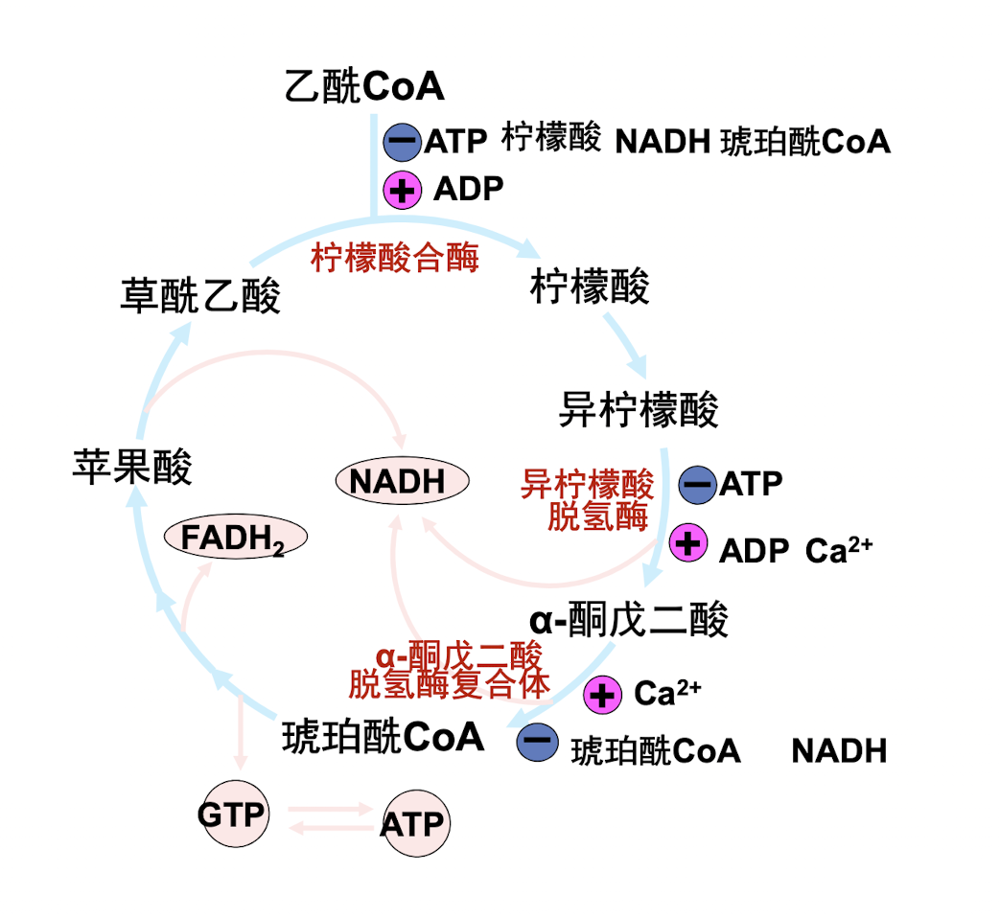
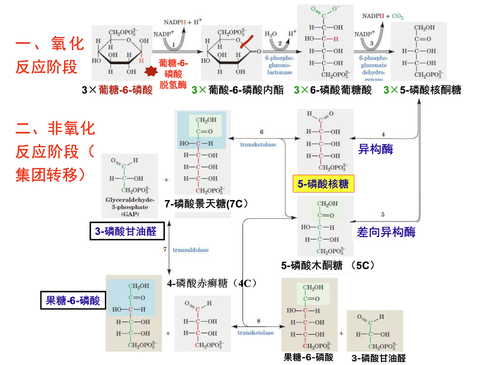
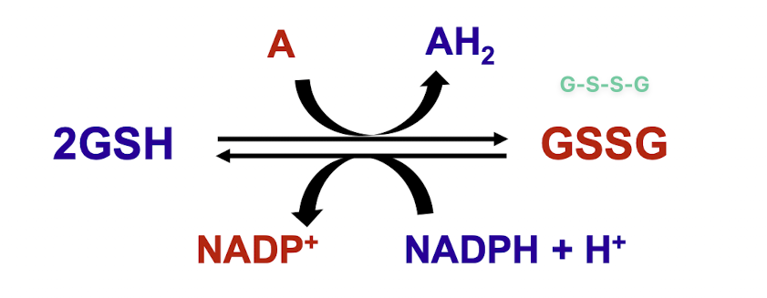
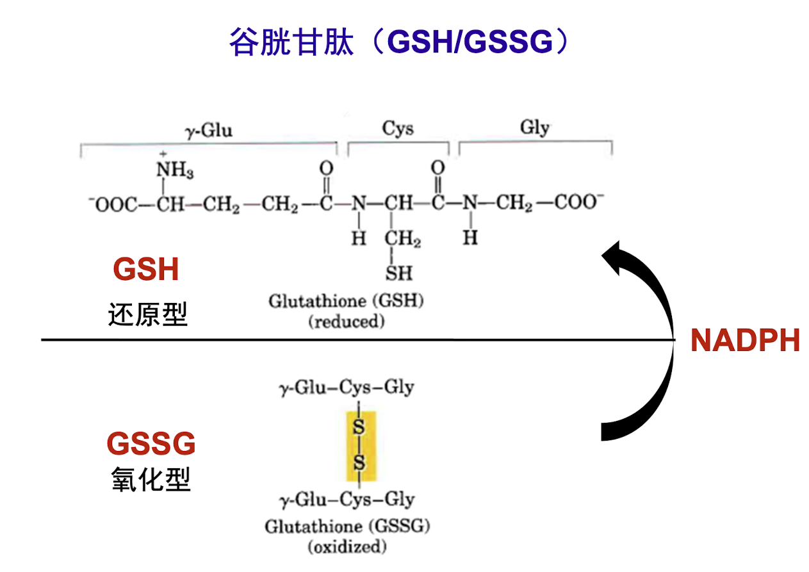
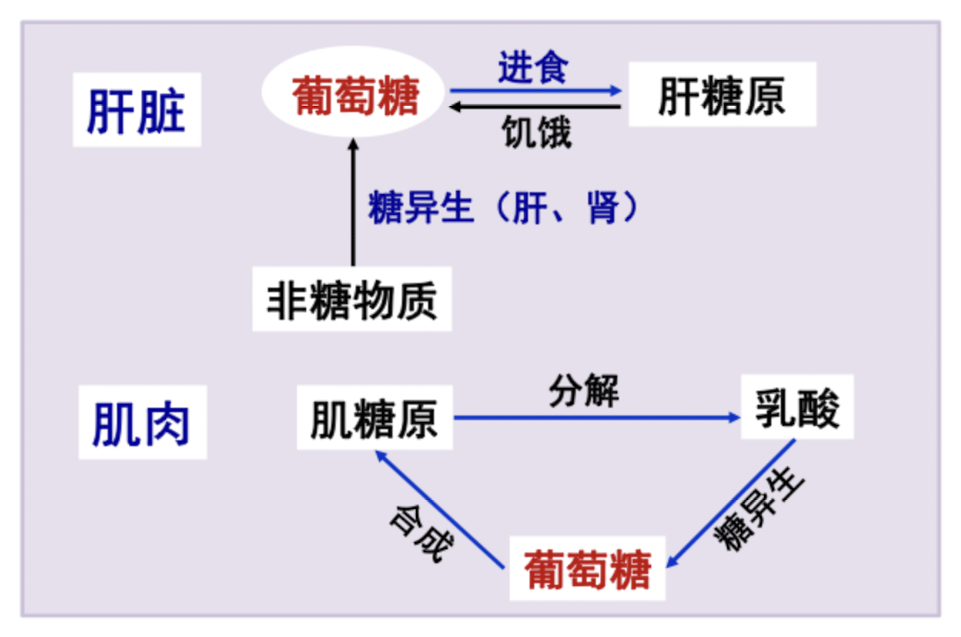
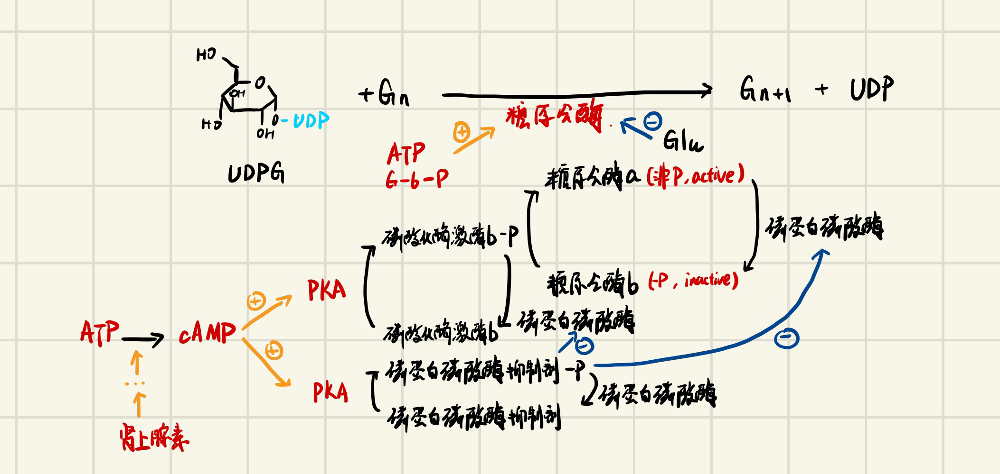

# 糖代谢

## 糖代谢概述

糖（carbohydrate）：多羟醛或多羟酮类化合物，又称碳水化合物。

糖的分类（按结构分）

* 单糖：葡萄糖、果糖、半乳糖、核糖
* 二糖：麦芽糖、蔗糖、乳糖
* 多糖：淀粉、糖原、纤维素

葡萄糖的半缩醛反应：

### 概述

食物中的糖类主要有：淀粉、糖原、纤维素、麦芽糖、蔗糖、乳糖、葡萄糖、果糖等

多糖及二糖被消化成单糖后才能在小肠被吸收

纤维素不能被人体消化、吸收（缺 $\beta$- 糖苷酶）

糖原（glycogen）：是动物体内糖的重要储存形式，包括肝糖原、肌糖原

### 生理功能

氧化供能（最主要功能）：

* 糖是人体最重要的能源物质（60%）
* 2840 kJ /mol 葡萄糖

重要碳源

* 糖代谢的中间产物可转变为其它含碳化合物，如氨基酸、脂肪酸、核苷等

细胞的重要组成成分

* 糖复合体（糖蛋白、蛋白多糖、糖脂）

食物中的糖：

* 消化后吸收：植物淀粉、动物糖原、麦芽糖、蔗糖、乳糖
* 葡萄糖：直接吸收

**乳糖不耐症** ：缺乏分解乳糖的乳糖酶，在食用牛奶后发生乳糖消化、吸收障碍，产生腹胀、腹泻等症状。

**纤维素** ：葡萄糖的多聚体，以 $\beta$-1,4 糖苷键相连，在人体内不能被消化（缺乏 $\beta$- 糖苷酶）

### 糖代谢的概况

葡萄糖转运蛋白（Glucose Transporter, GLUT）

## 糖原代谢（合成与分解）

$$
糖的储存 \left\{\begin {array}{lr} 脂肪（甘油三酯）\\ 糖原（迅速动用）\left\{\begin {array}{lr} 肝糖原（肝） \\ 肌糖原（骨骼肌） \end {array}\right. \end {array}\right.
$$

### 糖原（glycogen）

动物体内糖的一种储存形式，是机体能迅速动用的能量储备。

**结构特点**

1. 葡萄糖单元以 $\alpha$-1,4 - 糖苷键相连
2. 糖原分子存在多个分支，分支处葡萄糖以 $\alpha$-1,6 - 糖苷键相连
3. 每个糖原分子，含 **一个还原端，多个非还原端**。

**分布及功能**

* 肝（肝糖原）：补充血糖，维持血糖水平恒定
* 骨骼肌（肌糖原）：为肌肉收缩供能

### 糖原合成

合成场所：肝、骨骼肌（细胞质）

**过程**

1. $\ce {Glu +ATP->[己糖激酶][Mg^2+] Glu-6-P +ADP}$

   反应不可逆。

   在肝细胞中，另有葡糖激酶催化此反应，但其亲和力低，目的是保证血糖不太低。

2. $\ce {G-6-P <->[磷酸葡萄糖变位酶] G-1-P}$

3. $\ce {G-1-P + UTP ->[UDPG 焦磷酸化酶] UDPG +PPi}$

4. $\ce {UDPG + G_n ->[糖原合酶] UDP + G_{n+1}}$

每将一分子葡萄糖合成成糖原，消耗 2ATP（第一步磷酸化，第三步结合）

关键酶：己糖激酶 / 葡糖激酶，糖原合酶

**UDPG 是葡萄糖的活性形式**

#### 糖原分支的形成

$\ce{\alpha-1,4-糖苷键->[分支酶]\alpha-1,6-糖苷键}$

### 糖原分解

$$\ce{G_n +Pi->[糖原磷酸化酶^*]G_{n-1} + G-1-P}$$

$$\ce{G-6-P<->G-1-P->[G-6-P酶（肝）]Glu}$$

葡糖 - 6 - 磷酸酶（肝）：补充血糖，肌只能自用

分支处：脱支酶

#### 糖原分解的生理意义

* 肝细胞中有葡糖 - 6 - 磷酸酶，故肝糖原可补充血糖。
* 肌肉中缺乏此酶，故肌糖原不能分解成葡萄糖，只能在肌细胞中进行糖酵解或有氧氧化供能。维持血糖稳定。

### 糖原合成与分解的调节

* 糖原合酶（糖原合成的关键酶）
* 糖原磷酸化酶（糖原分解的关键酶）

**肾上腺素**：与受体结合后，激活 Gs 蛋白，进而激活 AC，使得细胞内 ATP 环化生成 cAMP，cAMP 激活 PKA，PKA 可以同时促进 磷酸化酶激酶 b 和 磷蛋白磷酸酶抑制剂 磷酸化， 前者会促进 糖原合酶 b 去磷酸化生成 无活性的糖原合酶 a 而后者会抑制 磷蛋白磷酸酶，进而抑制 糖原合酶 a 磷酸化成 有活性的 糖原合酶 b。总体效果：抑制糖原合成，促进糖原分解，升高血糖。

**变构调节**：

糖原合酶（糖原合成）

* 变构激活剂：葡糖 - 6 - 磷酸、ATP
* 变构抑制剂：AMP

糖原磷酸化酶（糖原分解）

* 变构抑制剂：葡萄糖

## 糖的无氧氧化

概念：缺氧时，葡萄糖在 **胞质**中生成乳酸并释放出**少量 ATP**

### 糖裂解 Glycolysis

1. $$\ce{Glu + ATP ->[己糖激酶/葡糖激酶（肝）][Mg^2+] G-6-P + ADP}$$

   Mg^2+^ 是己糖激酶的必需激活剂

   此步骤不可逆（逆向反应需要肝脏中的葡糖 - 6 - 磷酸酶）

   **己糖激酶**

   * 变构抑制剂：长链脂酰 CoA（对应脂肪充足的情况）；G-6-P（反馈抑制）

2. $$\ce{G-6-P<=>[Mg^2+][磷酸己糖异构酶]F-6-P}$$

3. $$\ce{F-6-P + ATP->[Mg^2+][PFK-1^*]F-1,6-BP}$$

   反应不可逆

   **PFK-1：磷酸果糖激酶 1**

   * 最强变构激活剂：F-2,6-BP
   * 变构激活剂：ADP/AMP（对应 ATP 缺少的情况）；F-1,6 - 二磷酸（正反馈，利于糖的分解）
   * 变构抑制剂：ATP / 柠檬酸（对应 ATP 充足的情况）
   * 激素调节：受胰高血糖素抑制
   * 该步反应为正反馈调节

4. $$\ce{F-1,6-BP<=>[醛缩酶]磷酸二羟丙酮+3-磷酸甘油醛}$$

5. $$\ce{磷酸二羟丙酮<=>[磷酸丙糖异构酶]3-磷酸甘油醛}$$

6. $$\ce{3-磷酸甘油醛+HPO4^2- +NAD+ <=>[GADPH]NADH +H+ +1,3二磷酸甘油酸}$$

   此步中，3 - 磷酸甘油醛被氧化（脱氢），**产生 NADH**

   GAPDH：3 - 磷酸甘油醛脱氢酶，Glyceraldehyde phosphate dehydrogenase（甘油 醛 磷酸盐 脱氢）

7. $$\ce{1,3二磷酸甘油酸+ADP<=>3-磷酸甘油酸+ATP}$$

   **此步发生底物水平磷酸化**（含高能磷酸基团的化合物，将高能磷酸基团转移给 ADP 生成 ATP 的过程）

   **氧化磷酸化（主要）**：Oxidative Phosphorylation，代谢物脱氢（氧化），氢经呼吸链传递给氧生成水，同时释放能量，使 ADP 磷酸化生成 ATP，氧化与磷酸化偶联。

8. $$\ce{3-磷酸甘油酸<=>[Mg^2+][磷酸甘油酸变位酶]2-磷酸甘油酸}$$

9. $$\ce{2-磷酸甘油酸<=>[烯醇化酶]磷酸烯醇式丙酮酸（PEP） +H2O}$$

10. $$\ce{磷酸烯醇式丙酮酸+ADP->[丙酮酸激酶]丙酮酸+ATP}$$

    **此步发生底物水平磷酸化**

    **丙酮酸激酶**
    
    * 变构激活剂：F-1,6-BP
    * 变构抑制剂：ATP / 长链脂肪酸（对应能量充足）
    * 化学修饰调节：在肝细胞中，可以对其进行磷酸化修饰，形成 丙酮酸激酶 - P，后者无活性
    * 激素调节：受胰高血糖素抑制
    
    反应不可逆

### 丙酮酸生成乳酸

$$\ce{丙酮酸+NADH +H+ <->[LDH]乳酸+NAD+}$$

LDH：乳酸脱氢酶，Lactic acid Dehydrogenase

NADH + H^+^ 来自第六步（3 - 磷酸甘油醛氧化脱氢生成 1,3 - 二磷酸甘油酸）

### 小结

三步不可逆：

1. 第一步：葡萄糖在己糖激酶 / Mg^2+^ 催化下磷酸化成 G-6-P
2. 第三步：F-6-P 在 PFK-1 下生成 F-1,6-BP
3. 第十步：PEP 在丙酮酸激酶催化下生成丙酮酸

其他进入方式：

1. $$\ce{甘露糖->[己糖激酶]甘露糖-6-P->[变位酶]F-6-P}$$
2. $$\ce{半乳糖->半乳糖激酶->半乳糖-1-P->G-1-P}$$
3. $$\ce{F->[果糖激酶（肝脏）]F-1-P->[磷酸果糖醛缩酶]甘油醛+磷酸二羟丙酮->3-磷酸甘油醛+磷酸二羟丙酮}$$
4. $$\ce{F->[己糖激酶（肌肉、脂肪组织）]F-6-P}$$

高能化合物：

* 1,3 - 二磷酸甘油酸
* PEP

### 特点：

反应部位：细胞质

关键酶：己糖激酶、磷酸果糖激酶 - 1、丙酮酸激酶

能量净生成：2ATP

* 消耗（-2）：第一步葡萄糖磷酸化，第三步 F-1-P 磷酸化生成 F-1,6-BP
* 生成（+2x2）：第七步 1,3 - 二磷酸甘油酸底物水平磷酸化生成 3 - 磷酸甘油酸，第 10 步 PEP 底物水平磷酸化生成丙酮酸
* 另外还有：第六步 3 - 磷酸甘油醛氧化脱氢生成 1,3 - 二磷酸甘油酸的同时生成一分子 NADH+H^+^
  * 无氧条件下被丙酮酸生成乳酸时消耗
  * 有氧条件下用于生成 ATP （1.5 或 2.5 个 ATP/NADH+H^+^）

### 生理意义

* 迅速供能

* 在缺氧条件下供能

  紧急供能：肌肉收缩

  生理功能：成熟红细胞（完全），无细胞器，不能进行有氧供能；神经细胞、白细胞、骨髓（部分），代谢活跃，相对缺氧。

  病理条件：严重贫血、呼吸功能障碍和循环功能障碍。

**Warburg Effert**

肿瘤细胞在有氧情况下也不彻底氧化葡萄糖，而是酵解生成乳酸。这称为 Warburg 效应，也称有氧糖酵解。

## 糖异生作用 Gluconeogenesis

是补充血糖的另一重要途径

**概念**：非糖物质（乳酸、甘油、某些氨基酸等）转变为葡萄糖或糖原的过程

主要组织：肝脏、肾脏

（neogenesis：新生）

### 糖异生途径（从丙酮酸生成葡萄糖的过程）

糖异生是糖裂解的逆反应，而糖裂解只有三步反应不可逆。

1. 第十步，$\ce{磷酸烯醇式丙酮酸+ADP->[丙酮酸激酶]丙酮酸+ATP}$ 的逆反应

   $$\ce{丙酮酸 +ATP +CO2->[丙酮酸羧化酶]草酰乙酸+ADP +Pi}$$（线粒体）

   $$\ce{草酰乙酸+GTP->[PEP羧激酶]PEP +GDP +CO2}$$（线粒体或者细胞质）

2. 第三步，$\ce{F-6-P + ATP->[Mg^2+][PFK-1^*]F-1,6-BP}$ 的逆反应

   $$\ce{F-1,6-BP->[果糖二磷酸酶-1]F-6-P}$$

3. 第一步，$\ce{Glu + ATP ->[己糖激酶/葡糖激酶（肝）][Mg^2+] G-6-P + ADP}$ 的逆反应

   $\ce{G-6-P ->[葡糖-6-磷酸酶（肝脏）]Glu}$

   

### 糖异生的调节

饱食：储备能量 $\rightarrow$ 糖原合成，脂肪酸合成 $\uparrow$

饥饿：维持血糖（肝）$\rightarrow$ 糖原分解，糖异生 $\uparrow$

#### 糖异生的限速酶

* 丙酮酸羧化酶
* PEP 羧激酶
* 果糖二磷酸酶 - 1
* 葡糖 - 6 - 磷酸酶

#### 调节

**代谢物的调节（变构调节）**

1. 糖异生的原料（甘油，氨基酸，乳酸及丙酮酸等）增多时，糖异生作用增强
2. 乙酰 CoA 促进糖异生（变构激活 **丙酮酸羧化酶**）
3. ATP、柠檬酸促进糖异生，ADP 与 AMP 抑制糖异生

**激素的调节**

1. 肾上腺素、胰高血糖素、糖皮质激素促进糖异生
2. 胰岛素抑制糖异生

> $\ce{胰高血糖素->[\ominus]F-2,6-BP->[\ominus]PFK-1}$
>
> $\ce{胰高血糖素->[\ominus]丙酮酸激酶}$
>
> $\ce{胰高血糖素->[\oplus]PEP羧激酶}$
>
> $\ce{胰岛素->[\oplus]F-2,6-BP->[\oplus]PFK-1}$
>
> $\ce{胰岛素->[\ominus]PEP羧激酶}$

糖酵解与糖异生协调调节

### 糖异生的生理意义

1. 维持血糖恒定（最主要）

2. 回收乳酸，补充肝糖原：乳酸循环（Cori 循环）

   > 乳酸循环：肌肉收缩时，葡萄糖通过糖酵解生成乳酸，乳酸经血液入肝，在肝内异生为葡萄糖，葡萄糖进入血液后又可被肌肉摄取的过程。（肌肉缺少葡糖 - 6 - 磷酸酶，需进行乳酸循环）

3. 维持酸碱平衡（长期饥饿，肾的糖异生）

## 糖的有氧氧化 aerobic oxidation

概念：葡萄糖或糖原在有氧条件下彻底氧化成 H~2~O 和 CO~2~，同时释放出能量的过程，这是糖氧化的主要方式

第一阶段：糖裂解

第二阶段：丙酮酸氧化脱羧（丙酮酸生成乙酰 CoA）

第三阶段：三羧酸循环（TCA 循环）

第四阶段：氧化磷酸化

$$\ce{G->[细胞质]丙酮酸->[线粒体]乙酰CoA->[TCA Cycle]NADH +H+ / FADH2 ->[氧化磷酸化]H2O}$$

### 糖裂解

### 丙酮酸氧化脱羧（线粒体）

$$\ce{丙酮酸+CoA-SH +NAD+ ->[PDH]NADH + 乙酰CoA + CO2}$$

3C $\rightarrow$ 2C

PDH：丙酮酸脱氢酶复合体

* 3 种酶：$E_1，E_2，E_3$
* 5 种辅酶：TPP、FAD、 NAD^+^、CoA、硫辛酸

丙酮酸脱氢酶 E1

硫辛酰乙酰基转移酶 E2

二氢硫辛酰脱氢酶 E3

辅酶：

* 焦磷酸硫胺素（TPP，含维生素 B1）
* 硫辛酸
* 辅酶 A（遍多酸，又称维生素 B5）
* 黄素腺嘌呤二核苷酸（FAD，含维生素 B2）
* 辅酶 I（NAD+，含维生素 B3）

脚气病 beriberi（了解）：由维生素 B1（又称硫胺素）缺乏引起，以消化系统、神经系统和心血管系统症状为主的全身性族病，又称维生素 B1 缺乏病（维生素 B1 缺乏，导致糖代谢障碍）

### 三羧酸循环（柠檬酸（TCA）循环，Krebs 循环）Tricarboxylic acid cycle

> 乙酰草酰成柠檬，柠檬异成 a - 酮。琥酰琥酸延胡索，苹果落在草丛中。

#### 过程

1. 柠檬酸形成
   
   $$\ce{草酰乙酸(4C) +乙酰CoA(2C) +H2O ->[柠檬酸合酶^*]HSCoA +H+ +柠檬酸(6C)}$$
   
   聚合酶，不消耗 ATP，这一步不算脱氢，因为氢是来自本质水的（？）
   
   调节：
   
   $\oplus$: ADP
   
   $\ominus$: ATP、柠檬酸、NADH、琥珀酰 CoA
   
2. 柠檬酸 $\rightarrow$ 异柠檬酸（变构）
   
   $$\ce{柠檬酸(6C) ->[顺乌头酸梅] 顺乌头酸(6C) + H2O ->[顺乌头酸梅] 异柠檬酸(6C)}$$
3. 异柠檬酸 $\rightarrow$ 生成 $\alpha$- 酮戊二酸（**氧化脱羧**）
   
   $$\ce{异柠檬酸(6C) +NAD(P)+ ->[异柠檬酸脱氢酶^*]NAD(P)H +H+ +\alpha-酮戊二酸(5C) + CO2}$$
   
   调节：

   $\oplus$: ADP、Ca2+
   
   $\ominus$: ATP
4. $\alpha$- 酮戊二酸 $\rightarrow$ 琥珀酰 CoA（**氧化脱羧**）
   
   $$\ce{\alpha-酮戊二酸(5C) +CoA-SH +NAD+ ->[\alpha-酮戊二酸脱氢酶复合体^*]NADH +H+ +琥珀酰CoA(4C) +CO2}$$
   
   这一步生成了高能硫酯键，在下一步内进行底物水平磷酸化
   
   调节：
   
   $\oplus$: Ca2+
   
   $\ominus$: 琥珀酰 CoA、NADH
5. 琥珀酰 CoA $\rightarrow$ 琥珀酸（**底物水平磷酸化**）
   
   $$\ce{琥珀酰CoA(4C) +GDP +Pi <=>[琥珀酰CoA合成酶]琥珀酸(4C) +GTP +HSCoA}$$
6. 琥珀酸 $\rightarrow$ 延胡索酸（**脱氢**）
   
   $$\ce{琥珀酸(4C) +FAD <=>[琥珀酸脱氢酶] FADH2 +延胡索酸(4C)}$$
7. 延胡索酸 $\rightarrow$ 苹果酸（加水）
   $$\ce{延胡索酸(4C) +H2O <=>[延胡索酸酶]苹果酸(4C)}$$
   
8. 苹果酸 $\rightarrow$ 草酰乙酸（脱氢）
   
   $$\ce{苹果酸(4C) +NAD+ <=>[苹果酸脱氢酶]NADH +H+ +草酰乙酸(4C)}$$

#### 特点

**反应部位**：线粒体

**关键酶**：

* 柠檬酸合酶，第一步
* 异柠檬酸脱氢酶，第三步
* $\alpha$- 酮戊二酸脱氢酶复合体，第四步

**能量计算**

* 四次脱氢（第三步，第四步，第六步，第八步），其中第六步脱给 FAD+，其他脱给 NAD+

* 两次脱羧（第三步，第四步）

* 一次底物水平磷酸化（第五步）

* 循环一周产生 3*2.5（NADH）+1.5（FADH2）+1（GTP）=10ATP

  反应部位已经在线粒体中了，NADH 就是 2.5ATP

* 三羧酸循环的中间产物不会因参与循环而被消耗，但可以参加其它代谢而被消耗。

  - $\alpha$- 酮戊二酸 $\rightleftharpoons$ 谷氨酸（5C）
  - 草酰乙酸 $\rightleftharpoons$ 天冬氨酸（4C）
  - 草酰乙酸 $\rightleftharpoons$ 丙酮酸 $\rightleftharpoons$ 丙氨酸（3C）

#### 糖的有氧氧化及三羧酸循环的生理意义

**糖有氧氧化最基本的生理功能是氧化供能**
$$
\ce {NADH->[生物氧化] 2.5 ATP\\FADH->[生物氧化] 1.5 ATP}
$$
有氧氧化：每分子葡萄糖产生 32 或 30 分子 ATP

> 具体算法：葡萄糖 → CO2 + H2O + ATP
>
> 1. 葡萄糖 → 丙酮酸 + 2NADH + 2ATP；
> 2. 丙酮酸 → 乙酰 CoA，产生 1 分子 NADH；
> 3. 一分子乙酰 CoA 经过三羧酸循环，产生 3NADH + 1FADH2 + 1ATP/GTP
> 4. 经过呼吸链：1NADH → 2.5 ATP；1FADH2 → 1.5ATP（旧数据是 2ATP）
>
> 总计：10NADH → 25ATP + 2FADH2 → 3ATP + 4ATP = 32ATP
>
> 考虑从胞质进入线粒体的过程，如进行苹果酸穿梭则不会减少能量，还是 32ATP，在脑等部位会进行 $\alpha$- 磷酸甘油穿梭，减少 2 分子 ATP，最终净产生 30ATP。

无氧氧化：每分子葡萄糖产生 2 分子 ATP

**三羧酸循环是糖、脂肪和蛋白质三大营养物质分解代谢的最终共同途径**

**三羧酸循环是糖、脂肪和氨基酸代谢联系和互变的枢纽。**

### 糖有氧氧化的调节

#### 糖裂解

* 己糖激酶
* 磷酸果糖激酶 - 1*（PFK-1）
* 丙酮酸激酶

#### 丙酮酸氧化脱羧（脱氢）

* 丙酮酸脱氢酶复合体：变构调节、化学修饰
  - 激活剂：AMP、ADP、 NAD+、 CoA-SH、 Ca2+
  - 抑制剂：ATP、NADH、乙酰 CoA、脂肪酸
  - 共价修饰调节：磷酸化失活；去磷酸化激活

#### 三羧酸循环

* 柠檬酸合酶

* 异柠檬酸脱氢酶

* $\alpha$- 酮戊二酸脱氢酶复合体

* 调节：

  - ATP、ADP 的影响（柠檬酸合酶，异柠檬酸脱氢酶，ATP 抑制，ADP 激活）
  - 产物堆积引起抑制（柠檬酸抑制柠檬酸合酶，琥珀酰 CoA、NADH 抑制 $\alpha$- 酮戊二酸脱氢酶）
  - 循环中后续反应中间产物变构抑制前面反应中的酶（琥珀酰 CoA、NADH 抑制柠檬酸合酶）
  - 其他，如 Ca2 + 可激活许多酶（异柠檬酸脱氢酶，$\alpha$- 酮戊二酸脱氢酶）

  

  

#### 巴斯德效应 Pasteur effect

糖有氧氧化抑制糖酵解的现象

> 缺氧时，糖酵解产生的 NADH+H^+^，可使丙酮酸转变为乳酸；
>
> 有氧时，NADH+H^+^ 进入线粒体内氧化，丙酮酸转变为乳酸因缺乏 NADH+H^+^ 而受抑制。

## 磷酸戊糖途径 Pentose Phosphate Pathway

葡萄糖分解代谢的另一重要途径

生理意义：生成磷酸戊糖、NADPH

反应部位：细胞质

反应过程

* 氧化反应阶段：生成磷酸戊糖、NADPH 和 CO~2~
* 非氧化反应阶段：磷酸戊糖再利用

辅酶 I（NAD）和辅酶 II（NADP）

### 过程

#### 氧化反应阶段

1. $$\ce{G-6-P + NADP+ ->[葡糖-6-磷酸脱氢酶]NADPH + H+ +葡糖-6-磷酸内脂}$$
2. $$\ce{葡糖-6-磷酸内脂+H2O->[6-磷酸葡糖酸内酯酶]6-磷酸葡萄糖酸}$$
3. $$\ce{6-磷酸葡萄糖酸+ NADP+ -> NADPH + CO2 +5-磷酸核酮糖}$$

#### 非氧化反应阶段（集团转移）

1. $$\ce{5-磷酸核酮糖<->[异构酶]5-磷酸核糖}$$
2. $$\ce{5-磷酸核酮糖<->[差向异构酶]5-磷酸木酮糖}$$
3. $$\ce{2· 5-磷酸核糖<->7-磷酸景天糖+3-磷酸甘油醛}$$
4. $$\ce{2·3-磷酸甘油醛<->F-6-P +4-磷酸赤癣糖}$$
5. $$\ce{4-磷酸赤癣糖+5-磷酸木酮糖<->F-6-P +3-磷酸甘油醛}$$

### 磷酸戊糖途径的调节

$$\ce{G-6-P + NADP+ ->[葡糖-6-磷酸脱氢酶][NADPH\ \ominus]NADPH + H+ +葡糖-6-磷酸内脂}$$

### 磷酸戊糖途径的生理意义

1. 为核酸的生物合成提供原料（5 - 磷酸核糖）

   $$\ce{5-磷酸核酮糖+ATP->[PRPP合成酶]AMP +PRPP(磷酸核糖焦磷酸)}$$

2. 产物 NADPH 作为供氢体，参与体内多种代谢反应

   NADPH 来源：

   * 第一步，$$\ce{G-6-P + NADP+ ->[葡糖-6-磷酸脱氢酶]NADPH + H+ +葡糖-6-磷酸内脂}$$
   * 第三步，$$\ce{6-磷酸葡萄糖酸+ NADP+ -> NADPH + CO2 +5-磷酸核酮糖}$$

   意义：

   * 体内许多合成代谢的供氢体（脂肪酸、胆固醇）

   * 参与体内羟化反应（生物转化）

   * 维持谷胱甘肽的还原状态（抗氧化剂）

     

     GSH：$\ce{\gamma-Glu-Cys-Gly}$

     

   病理：蚕豆病（葡糖 - 6 - 磷酸脱氢酶缺乏 $\to$ NADPH 生成不足 $\to$ 还原型谷胱甘肽（GSH） 减少。新鲜蚕豆是很强的氧化剂，当 G6PD 缺乏时，氧化剂不能被及时清除，导致红细胞膜被氧化而发生破裂 / 溶血）

   
   
## 血糖调节及代谢障碍

### 血糖的调节

**组织器官水平的调节（多种组织参与血糖调节）**

第二个循环被称作 Cori 循环。

**激素调节**

1. **胰高血糖素**：升高血糖（胰岛 $\alpha$- 细胞）

   * 抑制糖原合成，促进肝糖原分解
   * 促进糖异生
   * 脂肪动员加速
   * 抑制糖氧化
   * 增加来源，减少去路

   > $\ce{胰高血糖素->[\ominus]F-2,6-BP->[\ominus]PFK-1}$
   >
   > $\ce{胰高血糖素->[\ominus]丙酮酸激酶}$
   >
   > $\ce{胰高血糖素->[\oplus]PEP羧激酶}$

2. **胰岛素**：降低血糖（胰岛 $\beta$- 细胞）

   * 促进肌细胞、脂肪细胞摄取葡萄糖
   * 促进糖原合成，抑制肝糖原分解
   * 加快糖有氧氧化
   * 减缓脂肪的动员，从而减少脂肪酸对糖氧化的抑制
   * 抑制糖异生作用（抑制 PEP 羧）
   * 增加去路，减少来源

   > $\ce{胰岛素->[\oplus]F-2,6-BP->[\oplus]PFK-1}$
   >
   > $\ce{胰岛素->[\ominus]PEP羧激酶}$

3. **糖皮质激素**：升高血糖

   * 促进糖异生
   * 抑制肝外组织摄取和利用葡萄糖
   * 促进脂肪动员（抑制糖氧化）
   * 增加来源，减少去路

4. **肾上腺素**：升高血糖（应激时）

   * 加速糖原分解
   * 促进肌糖原酵解生成乳酸，加快糖异生

   

   

### 血糖异常

#### 低血糖

空腹血糖＜2.8 mmol/L

影响脑细胞功能，严重时出现昏迷（低血糖休克）

常见原因：

1. 胰岛细胞功能异常，导致胰岛素分泌过多；
2. 肾上腺皮质机能减退，导致糖皮质激素分沁不足；
3. 严重的肝脏疾患，不能有效调节血糖；
4. 饥饿时间过长或持续的剧烈体育运动；
5. 糖尿病人胰岛素使用过量。

#### 高血糖

空腹血糖 ≥ 7.0mmol/L

血糖浓度超过肾糖域时出现 **糖尿**

**糖尿病**：

持续性高血糖和糖尿

糖尿病主要类型：

* I 型（胰岛素依赖型）：因胰岛素缺乏，青少年多见。
* II 型（非胰岛素依赖型）：占 90％以上，因胰岛素受体减少或受体敏感性降低。

妊娠糖尿病

特殊类型糖尿病

**糖耐量试验**(glucose tolerance test, GTT)

临床上用来诊断病人有无糖代谢异常

正常人：服糖后 1/2~1h 达到高峰，然后逐渐降低，一般 2h 左右恢复正常值。

糖尿病患者：空腹血糖高于正常值，服糖后血糖浓度急剧升高，2h 后仍可高于正常。
