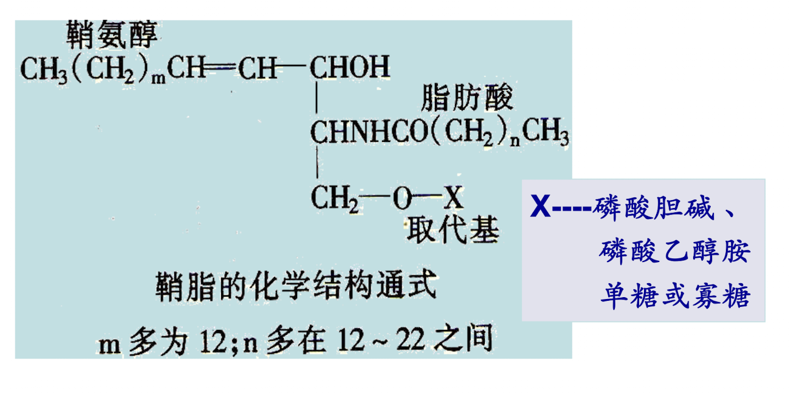

# 脂质代谢

## 脂质的构成、功能及分析

### 脂质 (lipid)

一类不溶于水，易溶于有机溶剂的大分子

* 脂肪 (fat)
  又称甘油三酯 (triglyceride, TG)
* 类脂 (lipoid)
  磷脂，糖脂，胆固醇，胆固醇酯

**脂肪酸** ：FA，fatty acid

* 脂肪酸 C 链长度：12~24C
* 多为偶数 C

$$\left\{\begin {array}{lr} 饱和脂肪酸\quad \ce{CH2-(CH2)n-COOH}
\quad saturated\ fatty\ acid\\不饱和脂肪酸 \quad
unsaturated\ fatty\ acid \left\{\begin {array}{lr}单不饱和脂肪酸 \\多不饱和脂肪酸 \end {array}\right.\end {array}\right.$$

换算：$\Delta^x = \omega-[n-x]$，n 是碳原子数

* 硬脂酸（18C）
* 软脂酸（16C）
* 油酸（18:1 ($\Delta^{9}$)）
* 亚油酸（18:2 ($\Delta^{9,12}$)），顺式脂肪酸
* 亚麻酸（18:3 ($\Delta^{9,12,15}$)），顺式脂肪酸

**必需脂肪酸**（essential fatty acid）：人体必需但自身不能合成或合成不足，必须依赖食物供给的脂肪酸。包括亚油酸、$\alpha$- 亚麻酸，均为多不饱和脂肪酸（PUFA）。

反式脂肪酸（Trans fatty acids）：含反式双键的脂肪酸，植物油加氢可产生。过多摄入可增加心血管疾病的风险。

### 脂质的生物学功能

#### 重要的能源物质（脂肪）

疏水性，利于储存（储能）

38kJ/g（糖：17kJ/g；蛋白质：17kJ/g）（供能）

#### 机体的重要结构成分

生物膜的重要成分：磷脂、胆固醇

脂肪组织的主要成分：甘油三脂

#### 参与细胞信号传递及代谢调节

类固醇激素 （肾上腺皮质激素、性激素）（胆固醇）

维生素 D~3~（胆固醇）、胆汁酸（胆固醇）

前列腺素、血栓素、白三烯（花生四烯酸）

第二信使：IP3， DAG（甘油二醇）（磷脂酰肌醇）

#### 内分泌器官

瘦素（Leptin）

脂联素（Adiponectin）

抵抗素（Resistin）

## 脂质的消化与吸收

### 脂质的消化（小肠上段）

胆汁酸盐将脂质乳化成细小的微团，有利于脂肪酶消化

$$\ce{甘油三酯+2H2O->[胰脂酶][辅脂酶]2-甘油一酯+2\ 脂肪酸}$$

$$\ce{磷脂->[磷脂酶A_2]溶血磷脂+脂肪酸}$$

$$\ce{胆固醇酯 +H2O->[胆固醇酯酶]胆固醇+脂肪酸}$$

### 脂质的吸收（十二指肠下段、空肠上段）

## 甘油三酯代谢

### 甘油三酯的分解代谢

#### 脂肪动员 fat mobilization

储存在白色脂肪细胞内的脂肪，被脂肪酶逐步水解为游离脂肪酸及甘油并释放入血，以供其它组织氧化利用的过程。

$$\ce{甘油三酯\\->[甘油三酯脂肪酶]FFA +甘油二酯\\
->[甘油二酯脂肪酶^*]FFA +甘油一酯\\->[甘油一酯脂肪酶]FFA +甘油}$$

FFA：游离脂肪酸

限速酶：甘油二酯脂肪酶，又叫激素敏感性脂肪酶（hormone-sensitive lipase, HSL）

$\oplus$ 脂解激素：促进其活性（肾上腺素、胰高血糖素、糖皮质激素）

$\ominus$ 抗脂解激素：抑制其活性（胰岛素、前列腺素 E~2~）

#### 甘油代谢 Glycerol Metabolism

1. $\ce{脂肪->[动员]FFA +甘油，FFA->[血浆清蛋白]运至全身}$
2. $\ce{甘油->[甘油激酶（肝、肾、肠）]3-磷酸甘油}$
3. $\ce{3-磷酸甘油<->[3-磷酸甘油脱氢酶]NADH +H+ +磷酸二羟丙酮}$
4. $\ce{磷酸二羟丙酮->[糖酵解][糖异生]终产物}$

#### 脂肪酸的氧化 Oxidation of Fatty Acids

脂肪酸是哺乳动物的主要能源物质，能充分氧化分解成 CO~2~ 及 H~2~O，并释放能量。

大多数组织（脑除外）均能氧化脂肪酸，肝、心肌、骨骼肌氧化能力最强。

脂肪酸的氧化方式：$\beta$- 氧化 $\beta$-oxidation

##### 脂肪酸活化为脂酰 CoA（线粒体外）

$$\ce{R-COOH +HS\sim CoA + ATP ->[Mg^2+][脂酰CoA合成酶]R-CO\sim SCoA +AMP +PPi}$$

* 线粒体外
* 不可逆反应
* 消耗 2 个高能磷酸键

##### 脂酰 CoA 进入线粒体（脂肪酸氧化的限速步骤）

$$\ce{脂酰CoA +肉碱<=>[肉碱脂酰转移酶I][肉碱脂酰转移酶II]CoASH +脂酰肉碱}$$

脂酰 CoA (C≥14) 的转移依赖：

1. 肉碱（carnitine）
2. 肉碱脂酰转移酶 I（线粒体外膜）：
3. 肉碱 - 脂酰肉碱转位酶（线粒体内膜）
4. 肉碱脂酰转移酶 II（线粒体内膜内侧）

##### 饱和脂肪酸的 $\beta$- 氧化

脂酰 CoA 进入线粒体基质后，从脂酰基的碳原子开始，经过 `脱氢、加水、再脱氢及硫解`4 步连续反应，碳链位断裂产生 1 分子乙酰 CoA 和 1 分子比原来少两个碳原子的脂酰 CoA（$\beta$ 碳被氧化为酰基）。

* 脱氢：脂酰 CoA 脱氢酶
* 加水：烯酰 CoA 水合酶
* 再脱氢：$\beta$- 羟脂酰 CoA 脱氢酶
* 硫解：$\beta$- 酮脂酰 CoA 硫解酶

1. 脱氢

   $$\ce{\underset{脂酰CoA}{RCH-CH2-CH2-Co\sim SCoA}+FAD\\->[脂酰CoA脱氢酶]FADH2 +\underset{\alpha,\beta-烯脂酰CoA}{RCH2CH=CH-CO\sim SCoA}}$$

2. 加水

   $$\ce{RCH2CH=CH-CO\sim SCoA +H2O\\->[烯酰CoA水合酶]\underset{\beta-羟脂酰CoA}{RCH2-CH[OH]-CH2-CO\sim  SCoA}}$$

3. 再脱氢

   $$\ce{\underset{\beta-羟脂酰CoA}{RCH2-CH[OH]-CH2-CO\sim  SCoA} +NADH +H+\\->[\beta-羟脂酰CoA脱氢酶]NADH +H+ +\underset{\beta-酮脂酰COA}{RCH2-CO-CH2-CO\sim SCoA}}$$

4. 硫解

   $$\ce{\underset{\beta-酮脂酰CoA}{RCH2-CO-CH2-CO\sim SCoA} +CoASH\\->[\beta-酮脂酰CoA硫解酶]\underset{脂酰CoA(少2C)}{RCH2-CO\sim SCoA}\underset{乙酰CoA}{ + CH-CO\sim SCoA}}$$

位置：线粒体基质

能量计算（一次 $\beta$ 氧化）

-2ATP（活化成脂酰 CoA）+ 1 FADH~2~ + 1 NADH+1 乙酰 CoA（10ATP (TCA)）

=12ATP

* 终产物是丙酰 CoA / 乙酰 CoA
* 丙酰 CoA$\to$ 琥珀酰 CoA$\to$TCA

#### 酮体（ketone body）的生成和利用

酮体：是脂肪酸在肝内分解氧化时的正常中间产物

##### 酮体的生成

1. $$\ce{2~乙酰CoA->[乙酰乙酰CoA硫解酶]CoASH +乙酰乙酰CoA}$$
2. $$\ce{乙酰乙酰CoA +乙酰CoA->[HMG-CoA合酶]CoASH +\underset{HMG-CoA}{羟甲基戊二酰CoA}}$$
3. $$\ce{\underset{HMG-CoA}{羟甲基戊二酰CoA}->[HMG-CoA裂解酶]乙酰CoA +乙酰乙酸}$$
4. $$\ce{乙酰乙酸 +NADH +H+->[\beta-羟丁酸脱氢酶]NAD+ +\beta-羟丁酸}$$
5. $$\ce{乙酰乙酸 ->CO2 +丙酮}$$

位置：肝线粒体

##### 酮体的利用

**肝内合成，肝外利用**

肝外组织：心肌、骨骼肌、大脑等（无法进行 $\beta$ 氧化，以酮体作为供能物质）

$$\ce{乙酰乙酸 +琥珀酰CoA<=>[琥珀酰CoA转硫酶]乙酰乙酰CoA +琥珀酸}$$

$$\ce{乙酰乙酰->[乙酰乙酰硫激酶]乙酰乙酰CoA}$$

$$\ce{乙酰乙酰CoA +CoASH->[乙酰乙酰CoA硫解酶]2~乙酰CoA->TCA}$$

$$\ce{\beta-羟丁酸->[\beta-羟丁酸脱氢酶]乙酰乙酸}$$

$$\ce{丙酮->丙酮酸或乳酸->[糖异生]葡萄糖}$$

$$\ce{丙酮->随呼吸或尿液排出}$$

##### 酮体生成的意义

能源物质：肝外组织，尤其是 **脑、肌肉**；脑组织不能氧化脂肪酸，可利用酮体；

长期饥饿，糖供应不足时，酮体是 **脑和肌肉** 的主要能源物质。

病理：血酮体升高 $\to$ 酮症酸中毒、酮尿

**各组织依赖的主要能源物质**

|                |   Glucose    |    FFA     |  KB  |
| :------------- | :----------: | :--------: | :--: |
| Red Blood Cell |      +       |            |      |
| Brain          |      +       |            |  +   |
| Muscle         | + （剧烈运动） | + （休息时） |  +   |
| Liver          |      +       |     +      |      |

> FFA：脂肪酸
>
> KB：酮体

##### 酮体生成的调节

1. 饱食及饥饿的影响（主要通过激素的作用）

   

2. 糖代谢的影响：糖代谢减弱，脂酸 $\beta$ 氧化及酮体生成均加强

   

   

### 内源性脂肪酸的合成 synthesis of fatty acids

脂肪酸的合成部位：细胞质（**肝**，脑，肾，肺，乳腺，脂肪组织）

原料：

* 乙酰 CoA（主要来自糖氧化分解）
* NADPH（主要来自磷酸戊糖途径）

#### 乙酰 CoA 运出线粒体

**柠檬酸 - 丙酮酸循环 Citrate pyruvate cycle**

又称苹果酸穿梭，苹果酸 - 草酰乙酸穿梭

1. $$\ce{草酰乙酸(4C) +乙酰CoA(2C) +H2O ->[柠檬酸合酶^*]HSCoA +H+ +柠檬酸(6C)}【线粒体内】$$
2. 柠檬酸经载体运输出线粒体内膜，到达胞质
3. $$\ce{柠檬酸(6C) +HSCoA->[柠檬酸裂解酶]草酰乙酸(4C) +乙酰CoA(2C)}【胞质】$$
4. $$\ce{草酰乙酸(4C) +NADH +H+<=>[苹果酸脱氢酶]苹果酸(4C) +NAD+ }【胞质】$$
5. 柠檬酸经载体运输出胞质，到达线粒体内

或：

1. $$\ce{草酰乙酸(4C) +乙酰CoA(2C) +H2O ->[柠檬酸合酶^*]HSCoA +H+ +柠檬酸(6C)}【线粒体内】$$
2. 柠檬酸经载体运输出线粒体内膜，到达胞质
3. $$\ce{柠檬酸(6C) +HSCoA->[柠檬酸裂解酶]草酰乙酸(4C) +乙酰CoA(2C)}【胞质】$$
4. $$\ce{草酰乙酸(4C) +NADH +H+<=>[苹果酸脱氢酶]苹果酸(4C) +NAD+ }【胞质】$$
5. $$\ce{苹果酸+NADP+->[苹果酸酶]NADPH + H+ +CO2 +丙酮酸}【胞质】$$
6. 丙酮酸经载体运输出胞质，到达线粒体内
7. $$\ce{丙酮酸 +ATP +CO2->[丙酮酸羧化酶]草酰乙酸+ADP +Pi}【线粒体内】$$

后一种较第一种，多损失了 1ATP。

有些反应是 [TCA 循环](./04 糖代谢.md# 过程)、[糖异生](./04 糖代谢.md# 糖异生途径（从丙酮酸生成葡萄糖的过程）) 的逆反应

#### 丙二酰 CoA 的合成（脂肪酸合成第一步）

$$\ce{乙酰CoA + HCO^-3 +ATP->[生物素][乙酰CoA羧化酶]\underset{丙二酰CoA}{HOOC-CH2-CO\sim SCoA} + ADP + Pi}$$

**乙酰 CoA 羧化酶为脂肪酸合成的限速酶**

变构调节：

$\oplus$: 柠檬酸，异柠檬酸

$\ominus$: 软脂酰 CoA 及长链脂酰 CoA

激素调节：

$\oplus$: 抗脂解激素：胰岛素 $\to$ 去磷酸化（激活）

$\ominus$: 脂解激素：肾上腺素，胰高血糖素 $\to$ 磷酸化（失活）

其他调节：

$\oplus$: 高糖膳食

#### 软脂酸（16C）的生物合成

由脂肪酸合酶（fatty acid synthase, FAS）

催化哺乳类：一条多肽链（多功能酶），二聚体形式有活性（FAS I）

大肠杆菌：7 种酶蛋白，酰基载体蛋白 (ACP)（FAS II）

$$\ce{乙酰CoA + 7丙二酰CoA +14NADPH +14H+\\->[脂肪酸合酶]14NADP+ + 软脂酸(16:0) + 8HSCoA +6H2O}$$

> 转移、缩合及还原反应循环往复，每次延长 2 个 C
>
> 合成过程中消耗 NADPH+H^+^ 及 ATP

#### 软脂酸碳链的延长（肝细胞内质网或线粒体）

1. 内质网（丙二酰 CoA 供给二碳单位）

   

2. 线粒体（乙酰 CoA 供给二碳单位）

   

#### 不饱和脂肪酸的合成

内质网：**去饱和酶**，**动物没有 $\Delta^9$ 以上的去饱和酶**

硬脂酸（18:0）$\to$ 油酸（18:1, $\Delta^9$）

软脂酸（16:0） $\to$ 软油酸（16:1, $\Delta^9$）

**必需脂肪酸**

* 亚油酸（18:2， $\Delta^{9,12}$）
* 亚麻酸（18:3, $\Delta^{9,12,15}$）
* 花生四烯酸（20:4，$\Delta^{5,8,11,14}$）

#### 多不饱和脂肪酸的重要衍生物

* 前列腺素 (prostaglandin, PG)
* 血栓素 (thromboxane, TX)
* 白三烯 (leukotrienes, LT)

与炎症、免疫、过敏、心血管病等有关

来源于 **花生四烯酸**

具有重要生理功能

#### 脂肪酸合成的调节

* [乙酰 CoA 羧化酶](# 丙二酰 CoA 的合成（脂肪酸合成第一步）)
* [柠檬酸裂解酶](# 乙酰 CoA 运出线粒体)
* [脂肪酸合酶]（软脂酸（16C）的生物合成）

##### 代谢物的调节：别构调节

$\oplus$: 乙酰 CoA、NADPH、ATP：糖分解代谢加强

$\oplus$: 柠檬酸、异柠檬酸

$\ominus$: 软脂酰 CoA：高脂膳食、饥饿

##### 激素的调节：化学修饰调节

$\oplus$: 胰岛素

$\ominus$: 胰高血糖素、肾上腺素、生长素

### 甘油三酯的合成 Biosynthesis of Triacylglycerol

#### 合成部位

肝细胞：能合成，不能储存（脂肪肝）

脂肪细胞：合成，储存

小肠粘膜细胞：利用脂肪消化产物再合成脂肪

#### 合成原料

甘油、脂肪酸（主要由葡萄糖代谢提供）

#### 合成基本过程

1. 甘油一酯途径（小肠黏膜细胞）

   

2. 甘油二酯途径（肝、脂肪细胞）

   

   

## 磷脂代谢 Metabolism of Phospholipids

磷脂：含磷酸的脂质 phospholipid

* 甘油磷脂（含甘油骨架）phosphoglyceride
* 鞘磷脂（含鞘氨醇骨架）sphingomyelin

磷脂是构成生物膜的重要成分

### 甘油磷脂的组成及结构

* 磷脂酰乙醇胺（Phosphatidyl Ethanolamine, PE）

  脑磷脂（cephalin）

  

* 磷脂酰胆碱（Phosphatidylcholine, PC）

  卵磷脂（lecithin）

  （细胞膜含量最多的磷脂）

  

* 磷脂酰肌醇（Phosphatidyl Inositol, PI）
  PIP2 $\to$ IP~3~ / DAG

  

  

* 磷脂酰丝氨酸（Phosphatidyl Serine, PS）

  

* 二磷脂酰甘油

  心磷脂（cardiolipin, CL）

  线粒体膜的主要脂质

  

### 甘油磷脂的合成

#### 合成部位

全身各组织细胞的 **内质网**（肝、肾、肠最活跃）

#### 合成原料

* 饱和脂肪酸、甘油：主要来自葡萄糖代谢
* 多不饱和脂肪酸（2 位）：食物
* 磷酸盐、胆碱、丝氨酸、肌醇
* ATP、 CTP

#### 合成基本过程

0. CDP - 乙醇胺 / CDP - 胆碱合成
    

1. 甘油二酯合成途径

   （磷脂酰乙醇胺 PE、磷脂酰胆碱 PC、[甘油三酯 TG](### 合成基本过程)）

   **甘油二酯** 是重要中间物

   CDP - 乙醇胺和 CDP - 胆碱提供乙醇胺、胆碱

   

2. CDP - 甘油二酯合成途径

   （磷脂酰肌醇 PI、磷脂酰丝氨酸 PS、二磷脂酰甘油：心磷脂，CL）

   CDP - 甘油二酯是重要中间物

   

   

3. 磷脂的其它合成途径

   

   

   

### 甘油磷脂的分解

#### 磷脂酶（A1、A2、 B、 C、 D）Phospholipase

#### 溶血磷脂 lysophospholipid

甘油磷脂水解脱去一个脂酰基的产物

磷脂酶 B1、B2

#### 鞘磷脂

鞘脂 (sphingolipids)：含鞘氨醇（sphingosine）或二氢鞘氨醇的脂质（这两个化合物比较类似甘油）。

按取代基 X 的不同，鞘脂分为：**鞘糖酯、鞘磷脂**

## 胆固醇代谢 Metabolism of Cholesterol

